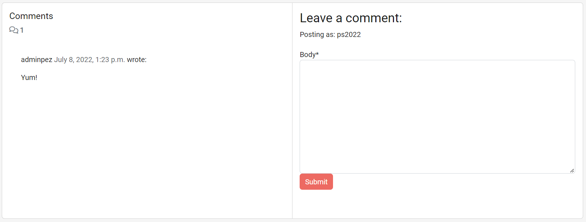

# FACEPLANT - Plant Based Recipe Community

 [View site here](https://faceplant-pp4.herokuapp.com/)

---

## About
Are you looking for new vegan recipes shared by a plant based community? Then you have come to the right place! 

FACEPLANT is a fully responsive website dedicated to sharing tried and tested recipes with it's community. Users can view recipes, submit their own, and leave comments expressing their adoration or adaptions to the recipes.

---

## Contents

---

## Target Audience
The Faceplant website is targeted towards users with an interest in plant based, vegan food that want to join a community of like minded food lovers. 

## Features
### Home Page
Users to the site are immediately greeted with the site logo in nav bar and a welcome message at top of the loaded page. The nav bar contains the neccessary links to access the main features of the site and is stuck to the top of the page so that the user can navigate to these links when scrolling down.

The Welcome Message for an unauthenticated user displays the website logo, brief about message and a call to action with a Register and Login button.

Logged in users are greeted with a Welcome Back message, logged in as: "user" info, and an "Add Recipe" button replacing the registration buttons.

Below the Welcome Message is the recipe feed which displays all uploaded recipes in most recent order. Each recipe preview shows a featured image, Author username, recipe title, the date and time of upload, and a like counter.

At the bottom of the page is the footer. This contains social media icon links, a copyright mark, and a small Faceplant logo that takes the user back to home page.

### Full Recipe Detail Pages
When a user clicks on the title of a recipe preview they will be taken to the full recipe detail page. The top of the page contains the featured immage, title, author username, upload time & date, like button and counter, and the recipe desription.

The ingredients section contains a list of required ingredients and the servings quantity. The method section is an ordered list of steps to create the recipe. On large displays these sections are side by side, on medium to small displays they are in columns.

Logged in users are able to submit comments at the bottom of the recipe page. Once the comment is submitted there is a success message notifying the user that their comment has been sent for approval. All comments need approval from the admin before they are published. Approved comments are on display to all users.

### Add Recipe Page
Authenticated users are able to add their own recipes to the website. To do this, simply click the Add Recipe button on homepage or in the Recipes submenu in navbar.
This will take the user to the recipe form. The form requires all but the image fields to be completed in order to submit. A placeholder image is used when a user doesn't upload an image or if there is an error during upload.

### Category Pages
The recipes are assigned one of four categories chosen by the author: Breakfast, Lunch, Dinner and Sweets. The user has the ability to view only the recipes in a selected category by accessing the sub menu in the recipes section of the nav bar. Each category page displays only the recipes assigned to that category in most recent order.

### 404 & 500 Pages
If a user encounters a server error or unknown page they are directed to a custom error page. This page gives the user an "Oops! You are lost" message and a link to go back home.

### User Registration, Login & Logout
Users are taken to the selected form which will only be submitted when fields are correctly entered. If the wrong info is entered there will be an error message displayed.

---

## Manual Testing
### Navbar and Footer
| Test | Action | Expected Result | Pass |
| ---- | ------ | --------------- | ---- |
| Navbar Logo | Click "FACEPLANT" logo | Returns the user to the home page. | ✓ |
| Navbar Home | Click "Home" | Returns the user to the home page. | ✓ |
| Navbar Register | Click "Register" | Takes the user to the Register page. | ✓ |
| Navbar Login | Click "Login" | Takes the user to the login page page. | ✓ |
| Navbar Logout for authenticated users only | Click "Logout" | Takes the user to the logout confirmation page page. | ✓ |
| Navbar Recipes Dropdown | Click "Recipes" logo | Displays Recipes sub-menu. | ✓ |
| Recipes sub-menu links for guest user | Click links | Takes the user to the relevant pages. | ✓ |
| Recipes sub-menu links for authenticated user | Click links | Takes the user to the relevant pages. | ✓ |
| Navbar small/medium screens | Click the hamburger icon | The Login, Register, Logout and Recipes sub-menu are available and work the same way as on large screens. | ✓ |
| Footer Socials Icons | Click Social Media icons | Each link opens a new tab to the corresponding social media website | ✓ |
| Footer Logo | Click small "FACEPLANT" logo | Takes any user to the home page | ✓ |

### Home Page
| Test | Action | Expected Result | Pass |
| ---- | ------ | --------------- | ---- |
| Welcome Greeting banner guest user | Click "Register" button | Takes user to the Register page. | ✓ |
| Welcome Greeting banner guest user | Click "Login" button | Takes user to the Login page. | ✓ |
| Welcome Greeting banner when logged in | Click "Add Recipe" button | Takes user to the Add Recipe page. | ✓ |
| Recipes Feed | Scroll down page | Displays upto six recipes in most recent order. | ✓ |
| Pagination | Click "Next" | If over six recipes in feed, next button appears above footer and takes user to the next page of recipes. | ✓ |
| View Recipe Detail | Click any recipe title | Takes the user to the correct recipe page. | ✓ |
| Responsive layout | Use Smaller Screen | The recipe previews will change from rows to columns on smaller devices | ✓ |

### Add Recipe Page
| Test | Action | Expected Result | Pass |
| ---- | ------ | --------------- | ---- |
| Form text input fields required | Click "Submit" button with no text entered in each field | Autoscrolls to highlighted empty input field. | ✓ |
| Form submitted | Enter required text to input fields and click submit | Submitted form returns user to the full recipe details page and displays a success message | ✓ |
| Recipe Image | Click "Choose File" button and upload custom image | The correct uploaded image is displayed in recipe detail. | ✓ |
| Placeholder Image | Do not upload custom image | Placeholder image should be displayed in recipe detail. | ✓ |
| Responsive layout | Use Smaller Screen | All fields can be read and used on smaller devices. | ✓ |

### View Recipe Detail Page
| Test | Action | Expected Result | Pass |
| ---- | ------ | --------------- | ---- |
| Display full recipe | Scroll through content | All recipe detail will be diplayed in relevant areas. | ✓ |
| Like counter guest user | Click the "like" icon | Icon should do nothing and like count will not increment | ✓ |
| Like counter logged in user user | Click the "like" icon | Icon should change to a solid color and like count will increment by 1 | ✓ |
| Comment Section guest user | Click the "Register" & "Login" buttons | Buttons should open the corresponding pages | ✓ |
| Comment Section logged in user user | Enter text into the "Leave a comment" box & click "Submit" button | Comment input box should disappear and green comment approval message should appear | ✓ |
| Responsive layout | Use Smaller Screen | Each section will change to columns on smaller devices | ✓ |

### Categories
| Test | Action | Expected Result | Pass |
| ---- | ------ | --------------- | ---- |
| Display correct Category recipes | Click Each Category in sub menu | Corresponding Category title banner and only recipes in each category shound be displayed. | ✓ |
| Responsive layout | Use Smaller Screen | The recipe previews will change from rows to columns on smaller devices | ✓ |

### Edit Recipe
| Test | Action | Expected Result | Pass |
| ---- | ------ | --------------- | ---- |
| Edit Button exists | View recipe you did not create | No edit button displayed. | ✓ |
| Edit Button exists | View recipe you did create | Edit button will be displayed next to date added. | ✓ |
| Edit Button | Click the "Edit" button | Will take the author of recipe to the edit form with previous data still intact ready for editing. | ✓ |

### Delete Recipe
| Test | Action | Expected Result | Pass |
| ---- | ------ | --------------- | ---- |
| Delete Button exists | View recipe you did not create | No delete button displayed. | ✓ |
| Delete Button exists | View recipe you did create | Delete button will be displayed next to Edit button. | ✓ |
| Delete Button | Click the "Delete" button | Will take the author of recipe to the delete confirmation page. | ✓ |
| Delete Confirmation | Click the confirm delete button | Will delete recipe from database, take the user to the all recipes page and display "recipe has been deleted" green success message. | ✓ |

### Authentication
| Test | Action | Expected Result | Pass |
| ---- | ------ | --------------- | ---- |
| Register new user | Click "Register" button and enter required information | The registration form is validating automatically if the username is valid and if the passwords match and are valid. Otherwise an error message is shown. | ✓ |
| Login | Click "Login" button and enter username and password | The Login form is validating if correct username and password is entered. Otherwise an error is shown | ✓ |
| Successful registration / login | Finish registration / login process | Temporary success message appears. User is logged in automatically and redirected to homepage which dispalys the signed in user under the Welcome Back message. | ✓ |
| Author access to delete and edit | Add /add or /delete to the url of author owned reipe | Author will have access to the edit and delete pages | ✓ |
| User access to delete and edit | Add /add or /delete to the url of non owned reipe | User will be redirected to a 404 Page | ✓ |
| Unauthenticated user access to Add Recipe | Add /add to the homepage urls | No Add Recipe buttons are viewable in menu or welcome page. If user adds /add to home url they will be redirected to the Sign In page | ✓ |
| Author access to delete and edit | Add /add or /delete to the url of author owned reipe | Author will have access to the edit and delete pages | ✓ |

### 404/500
| Test | Action | Expected Result | Pass |
| ---- | ------ | --------------- | ---- |
| Custom Error Pages  | Access 404/500 page | Both error pages will display styled pages inline with the rest of the site and show a custom "Lost" message with a link to home page. | ✓ |

### Admin
| Test | Action | Expected Result | Pass |
| ---- | ------ | --------------- | ---- |
| Admin Panel  | Access Admin panel when signed in as a superuser | Admin has access to all admin tools | ✓ |

### Success Messages
| Test | Action | Expected Result | Pass |
| ---- | ------ | --------------- | ---- |
| Success Message JavaScript Function  | Login and add, edit and delete a test recipe | Success message will hide after 5 seconds of succesful recipe update | ✓ |

---

## User Story Testing
### Admin:
* As a site Admin, I can login as a superuser so that I can access admin tools.
    * Admin superusers have access to the admin panel via  /admin. There they have full access to admin tools.

* As a site Admin, I can create, read, update and delete recipes so that I can manage the site content.
    * Use the admin panel and click on recipes. This provides the admin with the necessary tools to view, create, edit & delete recipes made by all users.  

* As an Admin I can Approve Comments so that I can monitor the context of user interaction and keep the site a safe space.
    * Within the Comments section of the admin panel, all submitted comments have approved status. To approve comments, select the comment and select “approve comment” from the dropdown menu and click the “Go” button.

### User:
* As a site user, I can register and login to the site so that I can like, and comment on recipes.
    * Users can Register or Login via the nav bar or welcome banner on the home page with one click.
    * The register page requests unique username(required), E-mail(optional) and password.
    * The Login page simply requests a username and password. 
    * Once logged in users can comment & like any recipe.

* As a site User/Admin, I can view posts so that I can choose which recipe to read.
    * All recipes can be viewed by any user via the home page or the View All category in the nav bar menu.

* As a site user, I can click on a recipe & view the full content.
    * Click the title of a recipe, this will take you to the full recipe detail page.

* As a logged-in user/admin, I can like & unlike recipes so that I can interact with recipes.
    * Once logged in the user can click the outlined “like” icon, once clicked the icon becomes a solid colour and the counter adds 1.
    * To unlike, the user can click the “like” icon which reverts to outlined style, and the counter removes 1 from total likes.

* As a Site User/Admin, I can Like and comment on a recipe so that I can interact with the Faceplant community.
    * Once logged in users can comment & like any recipe.

* As an authenticated user I can create a recipe post so that I can create and share my own content.
    * Once logged in, users have access to the “Add Recipe” form.
    * All fields are required and once submitted their recipe is added to the site.

* As a user, I can edit/update and delete my previous recipes so that I can keep my recipes relevant.
    * Once logged in, users can edit only their own recipes. To do this the user has access to the “Edit” & “Delete” buttons on their authored recipe detail pages.
    * The edit button opens the form which can be edited and submitted.
    * The delete button takes the user to a Delete Confirmation page with a “confirm” button. Clicking this will permanently delete the recipe.

* As a user, I can add a tag to the recipe so that the recipe can be filtered into related tags.
    * The category drop-down menu in the Add Recipe form contains each meal category. 
    *The Recipes sub-menu in the nav bar contains the Categories menu which will display only the recipes within that category.

* As an authenticated user I can click one button on the home page to add a new recipe so that I can instantly interact with the site.
    * The “Register” & “Login” buttons on the homepage welcome banner are replaced with the “Add Recipe” button once signed in. This opens the Add Recipe form with one click.

* As a user, I can view all recipes so that I do not have to return to the home page every time I want to view all.
    * The All Recipes option in the nav bar drop-down menu displays all recipes.
    * This page is the redirect page after deleting a recipe.

* As a user, I can be notified on-screen when I create edit & delete a recipe so that I know there were no errors.
    * Success messages appear after a recipe has been created, edited or deleted.
    * These appear at the top of the page and disappear after 5 seconds.

* As a user, I can be directed to a site-styled page not found page when I try to access unauthenticated pages so that I know I am on the Faceplant site.
    * Page not found - If a user tries to access a page that doesn’t exist or they do not have authority to access (deleting another users recipe) they are directed to a page with a “Go Home” button styled with the same base HTML as the rest of the site.

* As a user, I can navigate to previous pages and access home simply so that I can access familiar pages and use the site with ease.
    * The sticky nav bar has a home link and also the Faceplant logo directs users to the home page.
    * The footer also has the faceplant logo which directs back to home.

* As a user, I can intuitively understand what criteria I need to input on the form so that my recipe displays correctly.
    * The form has relevant titles for each input field.
    * The Ingredients and Method input fields have placeholder text prompting the user to use bullet points or a numbered list selectable from the toolbar.

* As a User, I can use the site on any size screen so that the design and UX is consistent on any device.
    * Screen sizes below 1000px wide trigger a hamburger menu icon to appear.
    * The site is responsive and has been tested on multiple screen sizes:
        * Desktop 16:9
        * Ipad air
        * Samsung S20 Ultra
        * iPhone 12pro
        * Google Pixel 6
        * Google Pixel 2

## Validation
### HTML
All custom written HTML code in my templates file has been tested using: https://validator.w3.org/ 
* Results
    * All custom HTML has no errors and one warning
    * Errors that do occur are caused by generated code within Django templating tags and Summernote

### CSS
CSS was also validated using: https://validator.w3.org/ 
* Results: No Errors or Warnings founds
### Python
All Python code conforms to the pep8 style guide and shows no linting errors in workspace.

## Lighthouse
I generated Lighthouse reports in chrome dev tools for the Home, Recipe Detail, and Category pages. All of which had no red warning scores. The performance score is not where I would like it but this is an issue regarding my image sizes and will work on this in the future.
Average mobile score:

